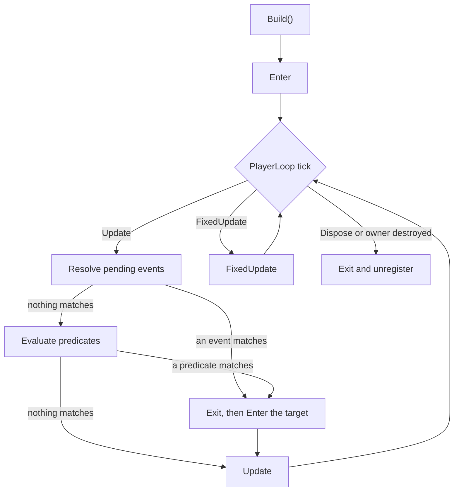

[← Back to the README](../README.md)

# Execution

`Build()` enters the initial state and registers the machine in the PlayerLoop. The update system is
injected right after `Update.ScriptRunBehaviourUpdate` and the fixed one right after
`FixedUpdate.ScriptRunBehaviourFixedUpdate`, so states see what `MonoBehaviour`s did in the same
frame and `FixedUpdate` still runs before the physics step.

`Build` creates the states, resolves and subscribes to the event sources, binds the context and
enters the initial state before registering the machine. `Update` resolves transitions first and then
runs the state that ended up active, so a transition and the target's first `Update` happen in the
same frame. `FixedUpdate` never resolves transitions and never consumes events. `Exit` always pairs
with the `Enter` that preceded it, including on the way out through `Dispose`.

A state is taken off the active path before its `Exit` runs, so a state that asks the machine about
itself from inside `Exit` is told what remains, not what is going: a child sees the parent that
stayed, and the top level state sees `CurrentStateType` as `null` with `ActiveStateCount` at `0`.

## Transition order

An update starts with the events published since the previous one, in the order they were published,
and only falls through to the predicates when none of them matched. Either way the search is the
same:

1. Global transitions declared with `Any()`.
2. Transitions of the active state, from the current state up through its parents.
3. Within a group, declaration order, following the order of the `Use<T>()` calls.
4. The first match wins — the event whose source was published, or the predicate that returned `true`.
5. Evaluation short-circuits there, and at most one transition runs per update.

No predicate after the winner is evaluated in that cycle, and none at all when an event already
decided the update. There is no numeric priority to tune: reorder rules by reordering declarations.

## Owner lifetime

Destroying the owner runs `Exit` and unregisters the machine, so controllers do not need
`OnDestroy`. Disabling the owner, or deactivating its GameObject, pauses the ticks without running
`Exit`; re-enabling it resumes from the same place.

Call `Dispose()` only to shut a machine down before its owner goes away. It is idempotent and runs
`Exit` exactly once. Keeping a reference is still useful for `IsRunning`, `CurrentStateType` and
`IsIn<TState>()`.

## Faults

If a callback or predicate throws, the machine does not end up half-transitioned: it is marked as
faulted, leaves the loop and stops running callbacks, without repeating the exception every frame.
During `Build` the exception propagates; during a PlayerLoop cycle it is reported to the console. A
machine that fails does not affect the others.

## Play mode boundaries

Leaving play mode, or anything that rebuilds the PlayerLoop, ends every machine that was still
running: each one runs `Exit` once, from the leaf up, cancels its activity, drops its event
subscriptions and lets go of its context and owner.

Nothing survives into the next session, so with Domain Reload turned off a second Enter Play Mode
starts as clean as the first, and a `FyniteEvent` held by a long-lived object never keeps a dead
machine alive. While that is happening, `Build()` refuses to start a machine that would have nowhere
to live — it throws instead of half-creating one.
