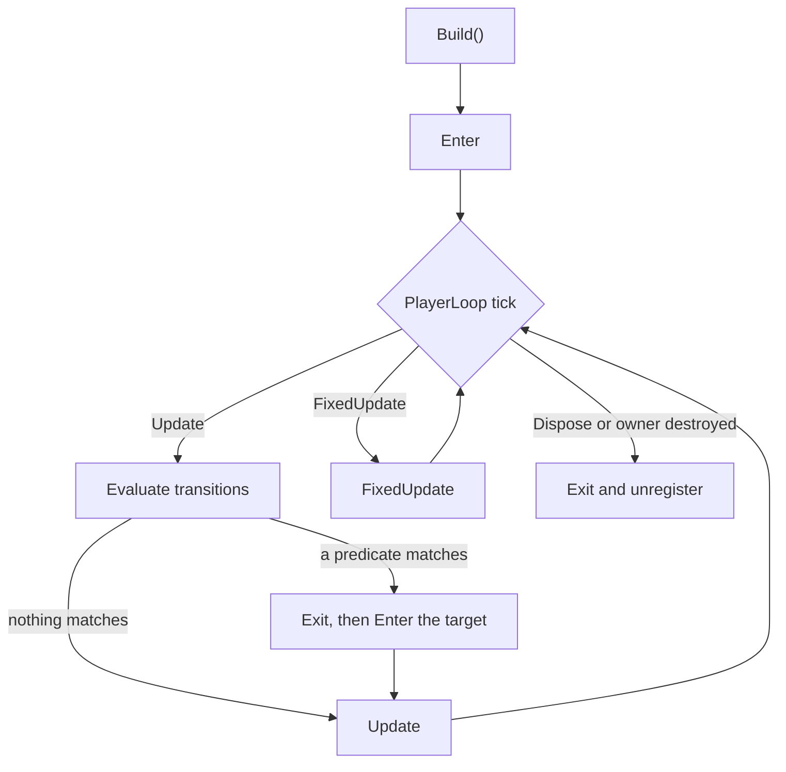

<div align="center">

# Fynite

**A code-first, type-safe state machine for Unity, driven automatically by the PlayerLoop.**

[](https://github.com/Natteens/fynite/releases)
[](https://unity.com)
[](LICENSE.md)

</div>

Fynite is a state machine you assemble in C#. There are no graph assets, no inspector wiring and no
reflection: states, conditions and the routing between them are plain classes, checked by the
compiler.

Behavior lives in states. A state overrides `Enter`, `Update`, `FixedUpdate` or `Exit` and reads
whatever it needs from a context object you own. Conditions live in predicates, each answering a
single question without side effects. Routing lives in transition modules, so a state never names
the state that follows it and can be reordered or reused without edits.

Building a machine hands it to the Unity PlayerLoop. `Build()` enters the initial state and
registers the machine; from there `Update` and `FixedUpdate` run on their own, and everything stops
when the owner is destroyed. There is no `machine.Update()` to forget in a `MonoBehaviour`.

## Quick start

Compose the machine where the entity is created:

```csharp
using Fynite;
using UnityEngine;

public sealed class PlayerController : MonoBehaviour
{
    [SerializeField] private PlayerInput input;
    [SerializeField] private PlayerMovement movement;

    private FyniteMachine<PlayerContext> machine;

    private void Awake()
    {
        var context = new PlayerContext(input, movement);

        machine = Machine
            .Attach(this, context)
            .Start<IdleState>()
            .Use<LocomotionTransitions>()
            .Build();
    }
}
```

A state is small and overrides only what it uses. `Context`, `DeltaTime` and `FixedDeltaTime` are
protected properties, so the callbacks take no parameters:

```csharp
public sealed class IdleState : FyniteState<PlayerContext>
{
    protected override void Enter()
    {
        Context.Movement.Stop();
    }
}
```

Transitions are declared together, away from the states they connect:

```csharp
public sealed class LocomotionTransitions : IFyniteTransitions<PlayerContext>
{
    public void Configure(FyniteTransitions<PlayerContext> transitions)
    {
        transitions
            .From<IdleState>()
            .To<WalkState>()
            .When<HasMovement>();

        transitions
            .From<WalkState>()
            .To<IdleState>()
            .When<HasNoMovement>();
    }
}
```

Every state named by `Start<T>()`, `From<T>()` or `To<T>()` is registered automatically, and each
one is instantiated exactly once per machine.

## Core concepts

The **context** is an ordinary class holding the data and services an entity needs. You create it
and pass it to `Attach`, and every state of that machine reads it through the protected `Context`
property.

A **state** is the behavior that runs while a mode is active. It knows nothing about the machine or
about the other states, which is what keeps it reusable.

A **predicate** answers one question and changes nothing. Implement `IPredicate<TContext>` when the
condition deserves a name, or pass a `static` lambda to `When` when it does not:

```csharp
transitions
    .From<IdleState>()
    .To<WalkState>()
    .When(static context => context.Input.HasMovement);
```

A **transition module** implements `IFyniteTransitions<TContext>` and groups related rules by
subject. Registering several with `Use<T>()` is how a machine gets composed from locomotion, combat
or damage rules that were written independently.

The **owner** is the Unity object passed to `Attach`. It controls the lifetime of the machine, which
is why no `PlayerMachine` or `EnemyMachine` class is needed.

## Automatic execution

`Build()` enters the initial state and registers the machine in the PlayerLoop. The update system is
injected right after `Update.ScriptRunBehaviourUpdate` and the fixed one right after
`FixedUpdate.ScriptRunBehaviourFixedUpdate`, so states see what `MonoBehaviour`s did in the same
frame and `FixedUpdate` still runs before the physics step.

Destroying the owner runs `Exit` and unregisters the machine, so controllers do not need
`OnDestroy`. Disabling the owner, or deactivating its GameObject, pauses the ticks without running
`Exit`; re-enabling it resumes from the same place. Call `Dispose()` only to shut a machine down
before its owner goes away — it is idempotent and runs `Exit` exactly once.

Keeping a reference is still useful for `IsRunning`, `CurrentStateType` and `IsIn<TState>()`.

## Transition order

1. Global transitions declared with `Any()`.
2. Transitions of the active state, from the current state up through its parents.
3. Within a group, declaration order, following the order of the `Use<T>()` calls.
4. The first predicate that returns `true` wins.
5. Evaluation short-circuits there, and at most one transition runs per update.

No predicate after the winner is evaluated in that cycle, and there is no numeric priority to tune.
Reordering rules is done by reordering declarations.

## Lifecycle



`Build` creates the states, binds the context and enters the initial state before registering the
machine. `Update` evaluates transitions first and then runs the state that ended up active, so a
transition and the target's first `Update` happen in the same frame. `FixedUpdate` never evaluates
transitions. `Exit` always pairs with the `Enter` that preceded it, including on the way out through
`Dispose`.

If any callback or predicate throws, the machine does not end up half-transitioned: it is marked as
faulted, leaves the loop and stops running callbacks, without repeating the exception every frame.
During `Build` the exception propagates; during a PlayerLoop cycle it is reported to the console. A
machine that fails does not affect the others.

## Hierarchy

States can contain other states. Declare the relationship where the machine is composed, and
everything else stays the same:

```csharp
machine = Machine
    .Attach(this, context)
    .Start<GroundedState>()
    .Child<GroundedState, LocomotionState>()
    .Child<GroundedState, AttackState>()
    .Use<PlayerTransitions>()
    .Build();
```

The first child declared is the one entered with its parent, so this machine starts in `Grounded`
and then in `Locomotion`. Use `InitialChild<TParent, TChild>()` only to override that convention.
`Start<T>()` still names the initial top-level state and cannot be a child.

While a child is active its parents are active too. `CurrentStateType` reports the deepest one and
`IsIn<T>()` answers `true` for any state on the path, so `IsIn<GroundedState>()` holds while
`AttackState` runs. `Enter`, `Update` and `FixedUpdate` run from the parent down; `Exit` runs from
the child up.

Transitions of the active child are evaluated before those of its parent, which is what makes
`Grounded → Airborne` apply to every child without being repeated. A transition into a state that
has children continues down to its initial child, and one that targets an active parent keeps that
parent running while restarting its branch.

Hierarchy is opt-in. A machine without a single `Child` call stays flat.

## Installation

Install through the Unity Package Manager using a Git URL. Always pin a published tag: a URL without
`#<tag>` resolves to whatever `main` points at, which may carry the same version number as the last
release and still contain different code.

<!-- fynite-release:start -->
The latest published release is **v0.9.0**.

In the Unity Package Manager, choose *Add package from git URL* and paste:

```
https://github.com/Natteens/fynite.git#v0.9.0
```

Or declare the dependency in `Packages/manifest.json`:

```json
{
  "dependencies": {
    "com.natteens.fynite": "https://github.com/Natteens/fynite.git#v0.9.0"
  }
}
```
<!-- fynite-release:end -->

Every published tag is listed on the [releases page](https://github.com/Natteens/fynite/releases).

## Sample

**Code First** builds a small locomotion machine: a `Grounded` state with `Idle` and `Walk` inside
it, an `Airborne` state next to it, and a controller with no `Update`, no `FixedUpdate` and no
`OnDestroy`. Import it from the Package Manager, under the *Samples* tab, and press play with the
`ExampleInput` component in the inspector.

## API overview

```csharp
Machine.Attach<TContext>(Object owner, TContext context)

FyniteMachineBuilder<TContext>.Start<TState>()
FyniteMachineBuilder<TContext>.Child<TParent, TChild>()
FyniteMachineBuilder<TContext>.InitialChild<TParent, TChild>()
FyniteMachineBuilder<TContext>.Use<TTransitions>()
FyniteMachineBuilder<TContext>.Build()

FyniteMachine<TContext>.IsRunning
FyniteMachine<TContext>.CurrentStateType
FyniteMachine<TContext>.IsIn<TState>()
FyniteMachine<TContext>.Dispose()

FyniteState<TContext>.Context
FyniteState<TContext>.DeltaTime
FyniteState<TContext>.FixedDeltaTime
```

Allocating during `Attach`, `Build` and while creating states, modules and predicates is expected.
The per-frame path allocates nothing intentionally, and uses no LINQ and no reflection.

## Changelog

Release notes are in [CHANGELOG.md](CHANGELOG.md).

## License

MIT. See [LICENSE.md](LICENSE.md).
